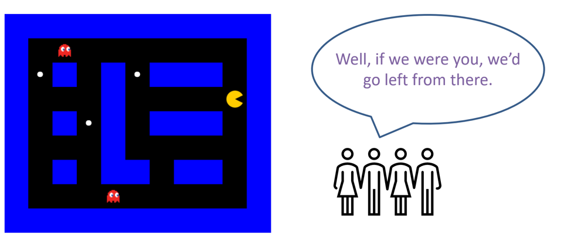
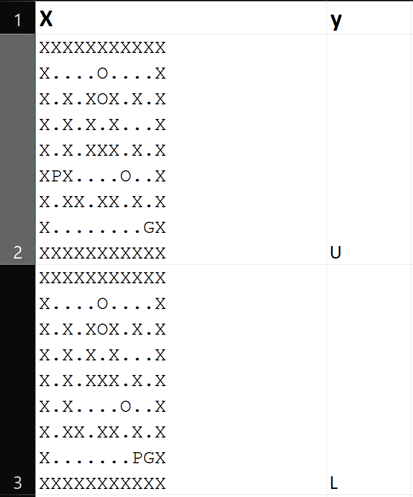
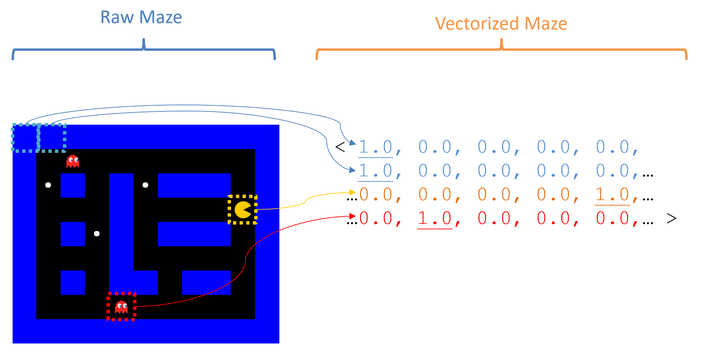
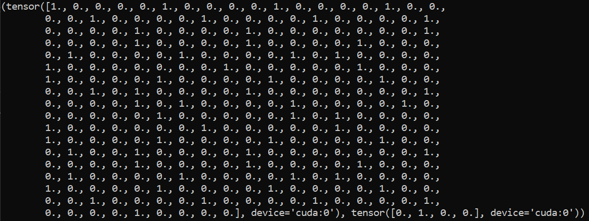
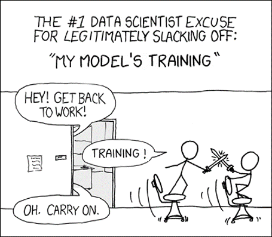

## Premise

**our task:**  Collect training data as a group to develop a neural network for imitation-learning Pacman.

**Imitation Learning** approximates complex behavior by imitating human reactions to similar stimuli.

**The Challenge:** get a basic Pacman playing agent through only examples of what to do in each game state!

## Setup

We will be using pytorch, a popular deep-learning library, for this assignment.

[Pytorch Setup](https://pytorch.org/get-started/locally/)

Through the remainder of this tutorial, we'll be following the Pytorch tutorials as a basic jumpstart into our task at hand.

[Pytorch Basics](https://pytorch.org/tutorials/beginner/basics/intro.html)

## Data Collection

Train an imitation learning agent with examples. You'll use Pacman Trainer:

[Pacman Trainer](https://pacmantrain.com/)

The steps you'll follow here are:

1. Join a Lobby: 
2. Label actions in response to prompts.
3. After labeling, upload the class dataset to GitHub Classroom.

## Specifications

As in most endeavors with machine learning, we will accomplish the following three steps in this deep learning project:

1. Preprocess the training data.
2. Construct, train, optimize Neural Network model.
3. Deploy the trained model.

We'll break down each step as we go, linking the relevant Pytorch tutorials (tutorchials?) as required reading before beginning the spec's next steps.

## Datasets

Pytorch Datasets are classes used to manage the training set and convert the raw data into formats that are usable by neural networks, viz., Tensors (fancy matrices).

- [Tutorial: Pytorch Tensors](https://pytorch.org/tutorials/beginner/basics/tensorqs_tutorial.html)
- [Tutorial: Pytorch Datasets and Loaders](https://pytorch.org/tutorials/beginner/basics/data_tutorial.html)

### Task 1: Implement the `PacmanMazeDataset` class in `pac_trainer.py`.

This step corresponds to the dataset tutorial's section: "Creating a Custom Dataset for your files"

As you'll notice from the tutorial, implementing this subclass of Pytorch's Dataset requires that we overload 3 methods; 

- `__init__(self, training_data)` maintains a reference to the loaded training data.
- `__len__(self)` returns how many rows / samples are in the training data.
- `__getitem__(self, index)` returns the *vectorized* data point *(X^{(i)}, y^{(i)})* for index *i*.

`__getitem__` method that calls 2 helpers: one to vectorize the input and another the output.

##### `vectorize_maze(maze)`

Converts the given maze (a String with newline `\n` characters separating the rows) into a vectorized format that will serve as the inputs into the neural network's input layer.

The trick: there are only so many things that can go in any one cell of the maze, which are listed in `Constants.ENTITIES` with each corresponding to a given index (e.g., walls are at index 0 in the `ENTITIES` list, ghosts at index 1, etc.).

Using these indexes,we created one-hot encoded sub-vectors for each cell where the output will be all of these individual one-hot encodings stitched together into a single 1-dimensional torch.tensor.

Consider one cell containing a wall `"X"`, which is at index 0 in the `ENTITIES` list (whose length is 5); this translates to a single one hot vector representation of: `<1, 0, 0, 0, 0>`. As another example, a pellet (index 2 in the ENTITIES) would translate to `<0, 0, 1, 0, 0>`.

we did this for all contents of the maze, and returned a single `torch.tensor` converted to the `float` datatype. Some tools that were helpful:

- `torch.flatten(tensor)` takes the given multi-dimensional tensor and flattens it to a single 1-D vector tensor.
- `torch.nn.functional.one_hot(values, num_classes)` takes a list / tensor of numerical labels and converts them into their one-hot equivalent given the total possible `num_classes`.

Essentially, the steps were as follow:

1. Go through every cell in the input maze and append the contents' index in `ENTITIES` to a list (the maze_entity_indexes map can be helpful here).
2. Convert that list to a tensor and use the tools above to output a 1-D tensor vector of one-hot encoded contents.

##### `vectorize_move(move)`

Same as above but much simpler: all we did was one-hot encode and return the possible movements available to Pacman, which are enumerated in the `Constants.MOVES` list.

If the label `y = "U"` is the given move, we would return a tensor representing `<1, 0, 0, 0>` because `"U"` is at index 0 in the `MOVES` list (thus why the 1-hot value in the vector is also positioned at index 0).

### Task 2: load the training data through the custom `PacmanMazeDataset`.

The steps for accomplishing this were as follows:

1. Read the raw training data which the team generated from its csv in the dat directory using a Pandas data frame. There will be 2 csvs here -- 1 which we generated (`our_data`), and another that was generated using faux labels (generated_data). 
2. Constructed a new `PacmanMazeDataset` object with the data frame we created
3. Created a DataLoader that will be used during training and constructed using our `PacmanMazeDataset` object from the previous step. 

Here's an example terminal-output from printing the Dataset's vectorized maze and label at index 0.

## Task 3: Network Construction

Time to do some networking! In this part, we defined the neural network structure by extending the `nn.Module` class in the `PacNet`.

The relevant Pytorch tutorial section can be found here:

- [Tutorial: Pytorch Network Building](https://pytorch.org/tutorials/beginner/basics/buildmodel_tutorial.html)

Let's begin by examining the example provided in the Pytorch tutorial above.

    class PacNet(nn.Module):
    """
    PyTorch Neural Network extension for the Pacman gridworld, which is fit to a
    particular maze configuration (walls, and optionally pellets, are in fixed spots)
    See: https://pytorch.org/tutorials/beginner/basics/buildmodel_tutorial.html
    """
    
    def __init__(self, input_size, output_size):
        """
        Initializes a PacNet for the given maze, which has maze-specific configuration
        requirements like the number of rows and cols. Used to perform imitation learning
        to select one of the 4 available actions in Constants.MOVES in response to the
        positional maze entities in Constants.ENTITIES
        :maze: The Pacman Maze structure on which this PacNet will be trained
        """
        super(PacNet, self).__init__()

        hidden_size1 = 128
        hidden_size2 = 64 
          
    
        # Define layers
        self.fc1 = nn.Linear(input_size, hidden_size1)
        self.fc2 = nn.Linear(hidden_size1, hidden_size2)
        self.fc3 = nn.Linear(hidden_size2, output_size)

        # Dropout layer for regularization 
        self.dropout = nn.Dropout(0.5)
        print("PacNet initialized.")
        

Notes on the above:
- In summary, the feed-forward network structure has 2 hidden layers with 128 neurons for the first layer and 64 neurons for the second layer. A

### Task 4: initialize the PacNet with the training maze structure!

to initialize the pacnet with the training maze structure we simply added the following line.

    # NN Construction
    model = PacNet(Constants.MAZE).to(Constants.DEVICE)

## Network Training & Optimization

Time to train our network weights, optimize our hyperparameters, and cross-validate on the training set.

The relevant tutorials:

- [Tutorial: Pytorch Network Learning and Optimization](https://pytorch.org/tutorials/beginner/basics/optimization_tutorial.html)
- [Tutorial: Pytorch Saving and Loading Network Parameters](https://pytorch.org/tutorials/beginner/basics/saveloadrun_tutorial.html)

### Task 5: Let the training begin! Time for backpropagation to work its magic.

This part is fairly standardized, though with some choices of hyperparameters. First, the following code simply goes after what you've already got in the main method:

    learning_rate = 1e-3
    batch_size = 27
    epochs = 10
    loss_fn = nn.CrossEntropyLoss()
    optimizer = torch.optim.Adam(model.parameters(), lr=learning_rate)
    for t in range(epochs):
        print(f"Epoch {t+1}\n-------------------------------")
        train_loop(train_dataloader, model, loss_fn, optimizer)
    print("Done!")
  

### Task 6: Save the weights!

to save our weigths we put the following line in the main method:

    # Saves weights in a dictionary at the given file path
    # for future use!
    torch.save(model.state_dict(), Constants.PARAM_PATH)

### Task 7: Initialize your Pacman agent's brain!:

1. we created a new PacNet attribute and initialize it with the maze on which this PacmanAgent was created.
2. Loaded the weights that we saved during training into this model. 

### Task 8: link the trained model with the Pacman environment.

In the PacmanAgent's `chooseAction(perception, legal_actions)` we did the following:

1. The perception parameter is an array of Strings representing the current maze-state -- we vectorized this using your `PacmanMazeDataset.vectorize_maze` from earlier.
2. Submitted this vectorized maze to the agent's PacNet, which will produce activations for each of the `Constants.MOVES` actions at the output layer. 
3. Have Pacman choose (i.e., return from this method) the *LEGAL* action from amongst those that has the highest activation